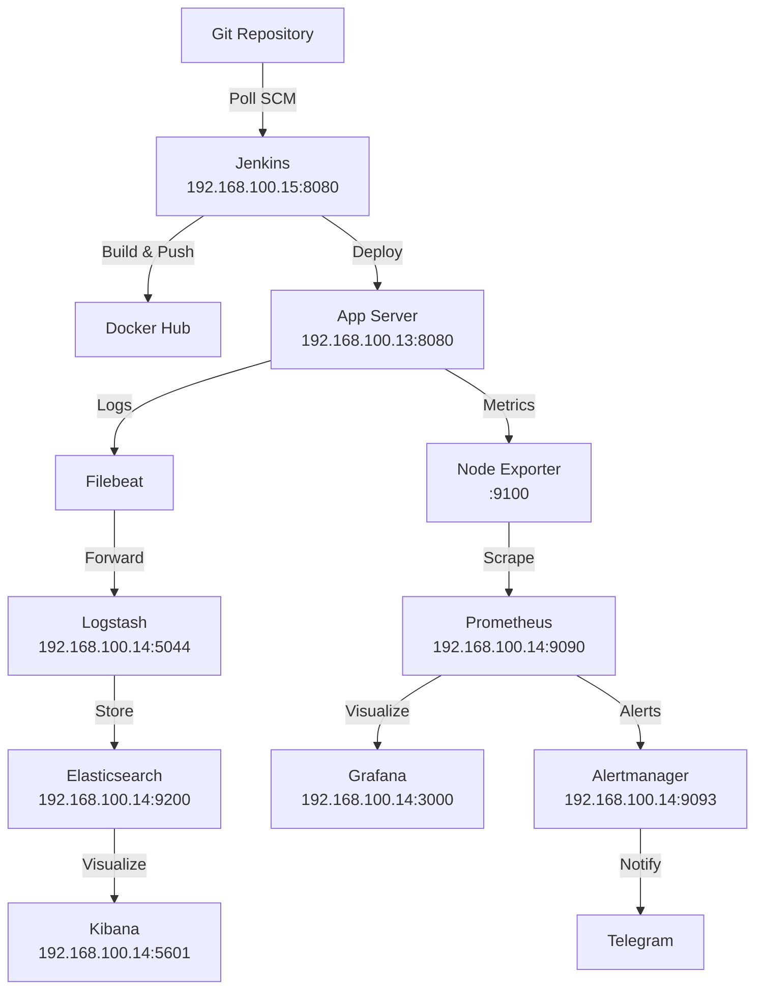

# DevOps Diploma Project

This repository contains the **DevOpsDiploma** project, a comprehensive demonstration of DevOps practices applied to a Java-based microservices application. It leverages **Infrastructure as Code (IaC)** with Ansible, a robust **CI/CD pipeline** powered by Jenkins, and a monitoring and logging stack using Prometheus, Grafana, Alertmanager, and the ELK Stack (Elasticsearch, Logstash, Kibana, Filebeat).

## Project Architecture

The project deploys a Java application across three servers:
- **Jenkins Server** (`192.168.100.15`): Hosts Jenkins for CI/CD, building and deploying the application.
- **App Server** (`192.168.100.13`): Runs the Java application in a Docker container.
- **Monitoring and Logging Server** (`192.168.100.14`): Hosts Prometheus, Grafana, Alertmanager for metrics and alerting, and the ELK Stack for log collection and visualization.

**Workflow**:
1. Jenkins polls the repository every 2 minutes, builds the Java application, runs tests, and pushes a Docker image to Docker Hub.
2. The application is deployed to the app server.
3. Filebeat collects logs from `/var/log` and sends them to Logstash, which processes and forwards them to Elasticsearch.
4. Kibana visualizes logs from Elasticsearch.
5. Node Exporter collects system metrics, Prometheus scrapes them, and Grafana displays dashboards.
6. Alertmanager sends notifications to Telegram for critical events.



## Project Structure

- **`ansible/`**: Contains Ansible playbooks, roles, and inventory for infrastructure management.
  - **`ansible.cfg`**: Configuration file with disabled host key checking and `ubuntu` as the default user.
  - **`inventories/`**:
    - **`group_vars/all.yml`**: Centralized variable definitions for all hosts.
    - **`hosts.yml`**: Inventory file listing servers and their connection details.
  - **`playbooks/setup.yml`**: Main playbook for orchestrating infrastructure deployment.
  - **`roles/`**: Modular roles for services (e.g., `alertmanager`, `prometheus`), each containing `tasks/`, `templates/`, and other resources.
- **`ci/`**: Stores `jenkins_home_prepared.tar.gz`, excluded from version control via `.gitignore`.
- **`java-app/`**: Java application source code and containerization configuration.
  - **`Dockerfile`**: Defines the container build process.
  - **`pom.xml`**: Maven configuration for dependency management and builds.
  - **`src/`**: Application source code and tests.
  - **`target/`**: Build artifacts generated by Maven.
- **`Jenkinsfile`**: Defines the CI/CD pipeline for automated builds and deployments.
- **`README.md`**: This documentation file.
- **`vault_pass.txt`**: Stores the Ansible Vault password for decrypting `ansible/vars/secrets/secrets.yml`.
- **`.gitignore`**: Excludes sensitive files and directories from version control.

## Prerequisites

To deploy and run this project, ensure you have:
- Ubuntu 24.04 (or a compatible Linux distribution) on all servers.
- Docker and Docker Compose installed on all servers.
- Java 21 and Maven for building the application (required on the Jenkins server).
- Git for cloning the repository.
- Ansible (version 2.9 or higher) for infrastructure provisioning.
- **System Requirements**:
  - **Jenkins Server**: At least 2 CPUs, 2GB RAM, 20GB disk space.
  - **App Server**: At least 1 CPU, 1GB RAM, 10GB disk space.
  - **Monitoring and Logging Server**: At least 2 CPUs, 6GB RAM (8GB recommended for production), 30GB disk space (due to ELK Stack storage needs).

## Installation and Setup

### 1. Clone the Repository
```bash
git clone https://github.com/mmoonly/DevOpsDiploma.git
cd DevOpsDiploma
```

### 2. Configure Ansible Vault
- Create `vault_pass.txt` with a strong password for decrypting `ansible/vars/secrets/secrets.yml`.
- Ensure `ansible/vars/secrets/secrets.yml` contains valid `telegram_bot_token` and `telegram_chat_id` for Alertmanager.

### 3. Update Inventory
- Modify `ansible/inventories/hosts.yml` to include your server IPs and SSH key paths. Example:
  ```yaml
  all:
    children:
      jenkins:
        hosts:
          jenkins_server:
            ansible_host: 192.168.100.15
            ansible_user: ubuntu
            ansible_ssh_private_key_file: ~/.ssh/id_rsa
      app:
        hosts:
          app_server:
            ansible_host: 192.168.100.13
            ansible_user: ubuntu
            ansible_ssh_private_key_file: ~/.ssh/id_rsa
      monitoring:
        hosts:
          monitoring_server:
            ansible_host: 192.168.100.14
            ansible_user: ubuntu
            ansible_ssh_private_key_file: ~/.ssh/id_rsa
  ```

### 4. Create `jenkins_home_prepared.tar.gz` (Optional)
If using `use_prepared_home=true` in the `jenkins` role (default), create the pre-configured Jenkins home archive. See `ansible/roles/jenkins/README.md` for detailed instructions.

### 5. Deploy the Infrastructure
- Execute the playbook to provision the infrastructure:
  ```bash
  ANSIBLE_VAULT_PASSWORD_FILE=vault_pass.txt ansible-playbook -i ansible/inventories/hosts.yml ansible/playbooks/setup.yml
  ```

### 6. Configure Jenkins CI/CD
- Access Jenkins at `http://192.168.100.15:8080`.
- If `use_prepared_home=false`, configure credentials manually:
  - `docker-creds`: Docker Hub authentication.
  - `jenkins-to-app-ssh`: SSH key for app server deployment.
  - `telegram-bot-token`: Telegram bot token for notifications.
  - `telegram-chat-id`: Telegram chat ID for notifications.
- The `Jenkinsfile` triggers builds every 2 minutes via `pollSCM('H/2 * * * *')`.

## Service Roles

The project includes Ansible roles for deploying and managing various services. For detailed information, refer to the `README.md` in each role's directory under `ansible/roles/`:

| Role             | Version       | Port  | Config Path                    | Data Path                      | Behavior                                                                 |
|------------------|---------------|-------|--------------------------------|--------------------------------|--------------------------------------------------------------------------|
| **alertmanager** | `latest`      | 9093  | `/data/alertmanager/configs`   | `/data/alertmanager/data`      | Resets if `alertmanager_flush=true`; deploys and configures if `false`.   |
| **elasticsearch**| `9.0.3`       | 9200  | `/data/elk/configs/elasticsearch` | `/data/elk/elasticsearch` | Resets if `elasticsearch_flush=true`; deploys and runs if `false`.        |
| **filebeat**     | `9.0.3`       | -     | `/data/elk/configs/filebeat`   | -                              | Resets logs if `filebeat_flush=true`; collects logs if `false`.           |
| **grafana**      | `latest`      | 3000  | `/data/grafana/configs`        | `/data/grafana/data`           | Resets if `grafana_flush=true`; deploys dashboards if `false`.            |
| **jenkins**      | `lts-jdk21`   | 8080  | `/opt/jenkins_home`            | -                              | Resets if `jenkins_flush=true`; deploys Java/Maven and runs if `false`.   |
| **kibana**       | `9.0.3`       | 5601  | `/data/elk/configs/kibana`     | `/data/elk/kibana`             | Resets if `kibana_flush=true`; deploys and visualizes if `false`.         |
| **logstash**     | `9.0.3`       | 5044  | `/data/elk/configs/logstash`   | `/data/elk/logstash`           | Resets if `logstash_flush=true`; deploys and filters logs if `false`.     |
| **node-exporter**| `latest`      | 9100  | -                              | -                              | Resets if `node_exporter_flush=true`; deploys metrics if `false`.         |
| **prometheus**   | `latest`      | 9090  | `/data/prometheus/configs`     | `/data/prometheus/data`        | Resets if `prometheus_flush=true`; deploys and monitors if `false`.       |

## CI/CD Pipeline

The Jenkins pipeline automates the build and deployment process with the following stages:
- **Checkout**: Clones the repository and updates submodules.
- **Lint**: Runs Checkstyle to enforce coding standards.
- **Build**: Compiles the application using Maven.
- **Test**: Executes unit tests.
- **Archive Artifacts**: Stores the compiled `.jar` file.
- **Docker Build & Push**: Builds and pushes the Docker image to Docker Hub.
- **Deploy to App Server**: Deploys the application to `192.168.100.13:8080`.
- **Notify**: Sends build status notifications via Telegram.

The pipeline is triggered every 2 minutes with `pollSCM('H/2 * * * *')`.

## Monitoring and Logging

The project includes a robust monitoring and logging stack:
- **Prometheus**: Collects metrics from `node-exporter` at `http://192.168.100.14:9090`.
- **Alertmanager**: Sends alerts to Telegram on port `9093`.
- **Grafana**: Provides dashboards at `http://192.168.100.14:3000`.
- **ELK Stack**:
  - **Elasticsearch**: Stores logs at `http://192.168.100.14:9200`.
  - **Logstash**: Processes logs on port `5044`.
  - **Kibana**: Visualizes logs at `http://192.168.100.14:5601`.
  - **Filebeat**: Collects logs from `/var/log`.

## Verification

To verify that services are running correctly, use the following commands from the Ansible control node:
```bash
# Jenkins
curl -I http://192.168.100.15:8080
# App Server
curl -I http://192.168.100.13:8080
# Prometheus
curl -I http://192.168.100.14:9090
# Grafana
curl -I http://192.168.100.14:3000
# Alertmanager
curl -I http://192.168.100.14:9093
# Elasticsearch
curl -I http://192.168.100.14:9200
# Kibana
curl -I http://192.168.100.14:5601
# Node Exporter
curl -I http://192.168.100.14:9100/metrics
```

Each command should return a `200 OK` status if the service is running.

## Tools Used

- **IaC**: Ansible for infrastructure provisioning.
- **CI/CD**: Jenkins for pipeline automation.
- **Monitoring**: Prometheus, Grafana, Alertmanager, Node Exporter.
- **Logging**: ELK Stack (Elasticsearch, Logstash, Kibana, Filebeat).
- **Application**: Java application built with Maven.

## Security Recommendations

- **Ansible Vault**: Use a strong password for `vault_pass.txt` and store it securely (e.g., in a password manager).
- **File Permissions**: Adjust directory permissions (e.g., `0777` in ELK roles) to stricter values (e.g., `0755` or `0700`) for production.
- **Network Security**: Restrict access to service ports (e.g., `9090`, `9200`, `5601`) using a firewall (e.g., `ufw`) or security groups.
- **Credentials**: Rotate `telegram_bot_token` and `telegram_chat_id` regularly and avoid hardcoding sensitive data.
- **HTTPS**: For production, configure a reverse proxy (e.g., Nginx) with HTTPS for Jenkins, Grafana, and Kibana.

## Project Status

- Infrastructure provisioning is fully functional.
- CI/CD pipeline is operational and actively used.
- Monitoring and logging systems are deployed and ready for testing.

## Author Information

This project is part of the **DevOpsDiploma** initiative. For feedback or contributions, open an issue or pull request on [GitHub](https://github.com/mmoonly/DevOpsDiploma).
